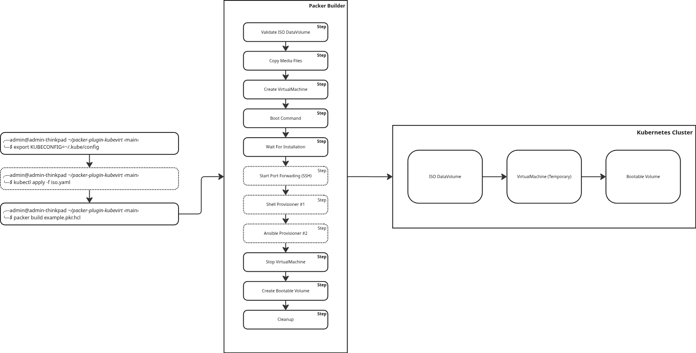

## Introduction

Creating and maintaining VM golden images can be time-consuming, often
requiring local virtualization tools and manual setup. With [KubeVirt](https://kubevirt.io)
running inside your [Kubernetes](https://kubernetes.io) cluster, you can
manage virtual machines alongside your containers, but it lacks automation
for creating consistent, reusable VM images.

That’s where [Packer](https://packer.io) and the new KubeVirt plugin come
in. The plugin lets you build VM images directly in Kubernetes, enabling you
to automate OS installation from ISO, customize the VM during build, and produce
a reusable bootable volume, all without leaving your cluster.

## Prerequisites

Before you begin, make sure you have the following installed:

- [Packer](https://developer.hashicorp.com/packer/install)
- [Kubernetes](https://kubernetes.io/docs/tasks/tools)
- [KubeVirt](https://kubevirt.io/user-guide/cluster_admin/installation)
- [Containerized Data Importer (CDI)](https://kubevirt.io/user-guide/storage/containerized_data_importer/#install-cdi)

## Plugin Features

The Packer plugin for KubeVirt offers a variety of features that simplify
the VM golden image creation process:

- **HCL Template**: Define infrastructure as code for easy versioning and reuse using [HCL templates](https://developer.hashicorp.com/packer/docs/templates/hcl_templates).
- **ISO Installation**: Build VM golden images from an ISO file using the `kubevirt-iso` builder.
- **ISO Media Files**: Include additional files (e.g., configs, scripts, and more) during the installation process.
- **Boot Command**: Automate the VM boot process via a [VNC](https://en.wikipedia.org/wiki/VNC) connection with a predefined set of commands.
- **Integrated SSH/WinRM Access**: Provision and customize VMs via [SSH](https://man7.org/linux/man-pages/man1/ssh.1.html) or [WinRM](https://learn.microsoft.com/en-us/windows/win32/winrm/portal).

**Note**: This plugin is currently in pre-release and actively under development by
[Red Hat](https://www.redhat.com) and [HashiCorp](https://www.hashicorp.com) together.

## Plugin Components

The core component of this plugin is the `kubevirt-iso` builder. This builder
allows you to start from an ISO file and create a VM golden image directly
on your Kubernetes cluster.

### Builder Design

<p align="center">
  
</p>

This diagram shows the workflow for building a bootable volume in a
Kubernetes cluster using Packer with the KubeVirt plugin.

1. Creates a temporary VM from an ISO image.
2. Runs provisioning using either the [Shell](https://developer.hashicorp.com/packer/docs/provisioners/shell) or [Ansible](https://developer.hashicorp.com/packer/integrations/hashicorp/ansible/latest/components/provisioner/ansible) provisioner.
3. Clones the VM’s disk to create a reusable bootable volume ([DataVolume and DataSource](https://kubevirt.io/user-guide/storage/disks_and_volumes/#datavolume)).

This bootable volume can then be reused to instantiate new VMs without
repeating the installation.

## Step-by-Step Example: Building a Fedora VM Image

The following Packer template (Fedora 42) demonstrates key features:

- ISO-based installation using the `kubevirt-iso` builder.
- Embedded configuration file to automate the installation.
- Sending boot commands to inject `ks.cfg` in GRUB.
- SSH provisioning with a [Shell](https://developer.hashicorp.com/packer/docs/provisioners/shell) provisioner.
- Full integration with [InstanceTypes and Preferences](https://kubevirt.io/user-guide/user_workloads/instancetypes).

Follow these steps to build a Fedora VM image inside your Kubernetes cluster.

### Step 1: Export KubeConfig Variable

Export your [KubeConfig](https://kubernetes.io/docs/concepts/configuration/organize-cluster-access-kubeconfig/#the-kubeconfig-environment-variable)
variable, which is also used by the Packer plugin:

```bash
export KUBECONFIG=~/.kube/config
```

This is required to communicate with your Kubernetes cluster.

### Step 2: Deploy ISO DataVolume

Create a [DataVolume](https://kubevirt.io/user-guide/storage/disks_and_volumes/#datavolume) to import the Fedora ISO into your cluster’s storage:

```bash
kubectl apply -f - <<EOF
apiVersion: cdi.kubevirt.io/v1beta1
kind: DataVolume
metadata:
  name: fedora-42-x86-64-iso
  annotations:
    #
    # This annotation triggers immediate binding of the PVC,
    # speeding up provisioning.
    #
    cdi.kubevirt.io/storage.bind.immediate.requested: "true"
spec:
  source:
    http:
      #
      # Please check if this URL link is valid, in case the import fails.
      # If so, please modify the URL here below.
      #
      url: "https://download.fedoraproject.org/pub/fedora/linux/releases/42/Server/x86_64/iso/Fedora-Server-dvd-x86_64-42-1.1.iso"
  pvc:
    accessModes:
      - ReadWriteOnce
    resources:
      requests:
        storage: 3Gi
EOF
```

#### Alternative: Upload a local ISO

Instead of importing from a URL, you can upload a local ISO
using the [virtctl](https://kubevirt.io/user-guide/user_workloads/virtctl_client_tool) client tool:

```bash
virtctl image-upload dv fedora-42-x86-64-iso \
  --size=3Gi \
  --image-path=./Fedora-Server-dvd-x86_64-42-1.1.iso \
```

The [Fedora Server 42 ISO](https://fedoraproject.org/server/download) is available on Fedora’s official website.

### Step 3: Create Kickstart File

This [Kickstart](https://en.wikipedia.org/wiki/Kickstart_(Linux)) file automates
Fedora installation, enabling unattended VM setup.

Create a file named `ks.cfg` with the following configuration:

```bash
cat > ks.cfg << 'EOF'
cdrom
text
firstboot --disable
lang en_US.UTF-8
keyboard us
timezone Europe/Paris --utc
selinux --enforcing
rootpw root
firewall --enabled --ssh
network --bootproto dhcp
user --groups=wheel --name=user --password=root --uid=1000 --gecos="user" --gid=1000

bootloader --location=mbr --append="net.ifnames=0 biosdevname=0 crashkernel=no"

zerombr
clearpart --all --initlabel
autopart --type=lvm

poweroff

%packages --excludedocs
@core
qemu-guest-agent
openssh-server
%end

%post
systemctl enable --now sshd
systemctl enable --now qemu-guest-agent
%end
EOF
```

This configuration enables SSH to provision the temporary VM, and [QEMU Guest Agent](https://qemu-project.gitlab.io/qemu/interop/qemu-ga.html)
to have a better integration with KubeVirt itself.

### Step 4: Create Packer Template

Create an example of the Packer template (`fedora.pkr.hcl`):

```bash
cat > fedora.pkr.hcl << 'EOF'
packer {
  required_plugins {
    kubevirt = {
      source  = "github.com/hashicorp/kubevirt"
      version = ">= 0.8.0"
    }
  }
}

variable "kube_config" {
  type    = string
  default = "${env("KUBECONFIG")}"
}

variable "namespace" {
  type    = string
  default = "vm-images"
}

variable "name" {
  type    = string
  default = "fedora-42-rand-85"
}

source "kubevirt-iso" "fedora" {
  # Kubernetes configuration
  kube_config   = var.kube_config
  name          = var.name
  namespace     = var.namespace

  # ISO configuration
  iso_volume_name = "fedora-42-x86-64-iso"

  # VM type and preferences
  disk_size          = "10Gi"
  instance_type      = "o1.medium"
  preference         = "fedora"
  os_type            = "linux"

  # Default network configuration
  networks {
    name = "default"

    pod {}
  }

  # Files to include in the ISO installation
  media_files = [
    "./ks.cfg"
  ]

  # Boot process configuration
  # A set of commands to send over VNC connection
  boot_command = [
    "<up>e",                            # Modify GRUB entry
    "<down><down><end>",                # Navigate to kernel line
    " inst.ks=hd:LABEL=OEMDRV:/ks.cfg", # Set kickstart file location
    "<leftCtrlOn>x<leftCtrlOff>"        # Boot with modified command line
  ]
  boot_wait                 = "10s"     # Time to wait after boot starts
  installation_wait_timeout = "15m"     # Timeout for installation to complete

  # SSH configuration
  communicator      = "ssh"
  ssh_host          = "127.0.0.1"
  ssh_local_port    = 2020
  ssh_remote_port   = 22
  ssh_username      = "user"
  ssh_password      = "root"
  ssh_wait_timeout  = "20m"
}

build {
  sources = ["source.kubevirt-iso.fedora"]

  provisioner "shell" {
    inline = [
      "echo 'Install packages, configure services, or tweak system settings here.'",
    ]
  }
}
EOF
```

### Step 5: Export VM Image (Optional)

Optionally, export the newly created disk image and package it
into a [containerDisk](https://kubevirt.io/user-guide/storage/disks_and_volumes/#containerdisk)
so it can be shared across multiple Kubernetes clusters.

#### Required Dependencies

Install these tools on the machine running Packer:

- `virtctl`: Exports the VM image from the KubeVirt cluster.
- `qemu-img`: Converts raw images to qcow2 format.
- `gunzip`: Decompresses exported VM images.
- `podman`: Builds and pushes container images.

#### Example

Add a `shell-local` post-processor to the Packer build, which runs after the build is completed:

```bash
variable "registry" {
  type    = string
  default = "quay.io/containerdisks"
}

variable "registry_username" {
  type      = string
  sensitive = true
}

variable "registry_password" {
  type      = string
  sensitive = true
}

variable "image_tag" {
  type    = string
  default = "latest"
}

build {
  ...

  post-processor "shell-local" {
    inline = [
      # Export VM disk image from PVC
      "virtctl -n ${var.namespace} vmexport download ${var.name}-export --pvc=${var.name} --output=${var.name}.img.gz",

      # Decompress exported VM image
      "gunzip -k ${var.name}.img.gz",

      # Convert raw image to qcow2 (smaller and more efficient format)
      "qemu-img convert -c -O qcow2 ${var.name}.img ${var.name}.qcow2",

      # Generate Containerfile
      "echo 'FROM scratch' > ${var.name}.Containerfile",
      "echo 'COPY ${var.name}.qcow2 /disk/' >> ${var.name}.Containerfile",

      # Login to registry
      "podman login -u ${var.registry_username} -p ${var.registry_password} ${var.registry}",

      # Build and push image
      "podman build -t ${var.registry}/${var.name}:${var.image_tag} -f ${var.name}.Containerfile .",
      "podman push ${var.registry}/${var.name}:${var.image_tag}"
    ]
  }
}
```

Sensitive credentials such as registry usernames and passwords should never be hardcoded in templates.

### Step 6: Initialize Packer Plugin

Run the following command once to install the Packer plugin:

```bash
packer init fedora.pkr.hcl
```

This downloads and sets up the KubeVirt plugin automatically.

### Step 7: Run Packer Build

Finally, run a build to create a new VM golden image with:

```bash
packer build fedora.pkr.hcl
```

Packer will create a new VM golden image in your Kubernetes cluster.

## Conclusion

In this walkthrough, you built a Fedora VM golden image inside Kubernetes
using Packer and the KubeVirt plugin. You defined an ISO source, automated
installation with Kickstart configuration and provisioned the VM over SSH
— all within your Kubernetes cluster.

From here, you can:

- Reuse the bootable volume to launch new VMs instantly.
- Integrate Packer builds into your CI/CD pipelines.
- Adapt the same process to build images for other operating systems, such as [RHEL](https://github.com/hashicorp/packer-plugin-kubevirt/tree/main/examples/builder/kubevirt-iso/rhel) and [Windows](https://github.com/hashicorp/packer-plugin-kubevirt/tree/main/examples/builder/kubevirt-iso/windows).

The plugin is still in pre-release, but it already offers a streamlined way
to create consistent VM images inside Kubernetes.

Give it a try and share your feedback or contributions on [GitHub](https://github.com/hashicorp/packer-plugin-kubevirt)!
