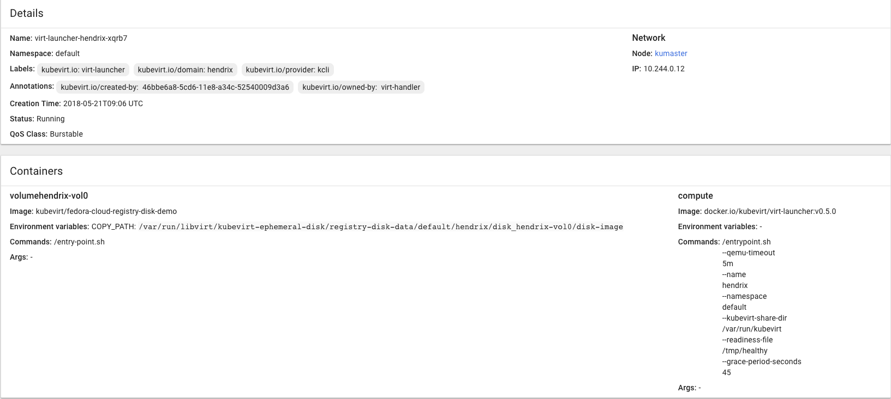
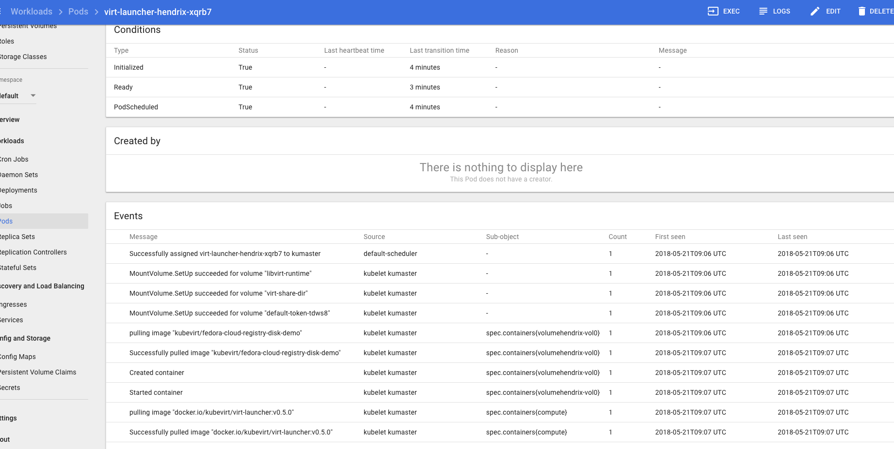

# KubeVirt Quickstart

This will deploy [KubeVirt](https://www.kubevirt.io) on an existing Kubernetes (1.11 or
later) or OpenShift Origin (3.11 or later) cluster. For a quick way to bring up a Kubernetes or OpenShift Origin cluster, see [Minikube](https://github.com/kubernetes/minikube/){:target="_blank"} and [Minishift](https://www.openshift.org/minishift/){:target="_blank"}.

### Deploy KubeVirt Operator

KubeVirt is deployed by means of an operator, using the `kubectl` tool and the following commands:

```bash

```

### Check Virtualization Extensions

To check if your CPU supports virtualization extensions perform:

```bash

```

If it doesn't Then create the following configuration map so that kubevirt uses emulation
mode:

```bash

```

Such a procedure is mandatory for minishift

### Deploy KubeVirt

KubeVirt is then deployed by creating a dedicated custom resource:

```bash

```

### Install virtctl

An additional binary is provided to get quick access to the serial and graphical ports of a VM, and handle start/stop operations.
The tool is called `virtctl` and can be retrieved from the release page of KubeVirt:

```bash

```

### Deploy a VirtualMachine

Once you deployed KubeVirt you are ready to launch a VM:

```bash

```

### Accessing VMs (serial console & spice)

```bash

```

### User Guide

Now that KubeVirt is up an running, you can take a look at the [user guide](https://www.kubevirt.io/user-guide/#/) to understand how you can create and manage your own virtual machines.

## Appendix: Deploying minikube

1. If not installed, install minikube as described [here](https://github.com/kubernetes/minikube/){:target="_blank"}
   1. Install the [kvm2 driver](https://github.com/kubernetes/minikube/blob/master/docs/drivers.md#kvm2-driver){:target="_blank"}
   2. Verify nested virtualization is enabled on the machine minikube is being installed on:
       ```bash

       ```
       If not, then enable it as described [here](https://docs.fedoraproject.org/en-US/quick-docs/using-nested-virtualization-in-kvm/index.html){:target="_blank"}

   3. Download the [`minikube` binary](https://github.com/kubernetes/minikube/releases){:target="_blank"}
2. Launch minikube with CNI:

    ```bash

    ```
3. Install `kubectl` via a package manager or [download](https://kubernetes.io/docs/tasks/tools/install-kubectl/#install-kubectl-binary-via-curl){:target="_blank"} it

---

# KubeVirt on an existing Kubernetes cluster {#install_3}

If you already have a Kubernetes cluster, you can use [kubevirt-ansible](https://github.com/kubevirt/kubevirt-ansible){:target="_blank"} to deploy KubeVirt.

First clone the kubevirt-ansible repo on your master Kubernetes node.

```bash

```

## KubeVirt with no additional storage

To install KubeVirt without adding additional storage capabilities:

```bash

```

## KubeVirt with storage environment for development and testing

KubeVirt can also be installed with a self-contained storage environment,
using Ceph and Cinder, that is geared for non-production use. To install
KubeVirt with the demo storage environment, first edit the inventory file
and populate the section named "masters", "etcd", and "nodes".

```ini

```

Once you have your inventory file filled in:

```bash

```

## KubeVirt with GlusterFS and Heketi storage environment

To install GlusterFS and Heketi on Kubernetes, follow the setup guide in
 [gluster-kubernetes repo](https://github.com/gluster/gluster-kubernetes){:target="_blank"}.
You will need to configure the admin key with gk-deploy and at end of the
install note the Heketi URL.

Once you have GlusterFS and Heketi installed on your Kubernetes cluster,
you can deploy KubeVirt with the storage-glusterfs role to setup a Secret
and a StorageClass to allow you to provision Persistent Volume Claims to
store your VM images.

First edit the inventory file and populate the sections "master", "etcd",
"nodes", and "glusterfs".

```bash

```

Then run this playbook, substituting the namespaces and heketi_url to
match your environment:

```bash

```

## How it looks in the UI

Provided you deployed kubernetes dashboard, you will see this kind of pods for your vms




