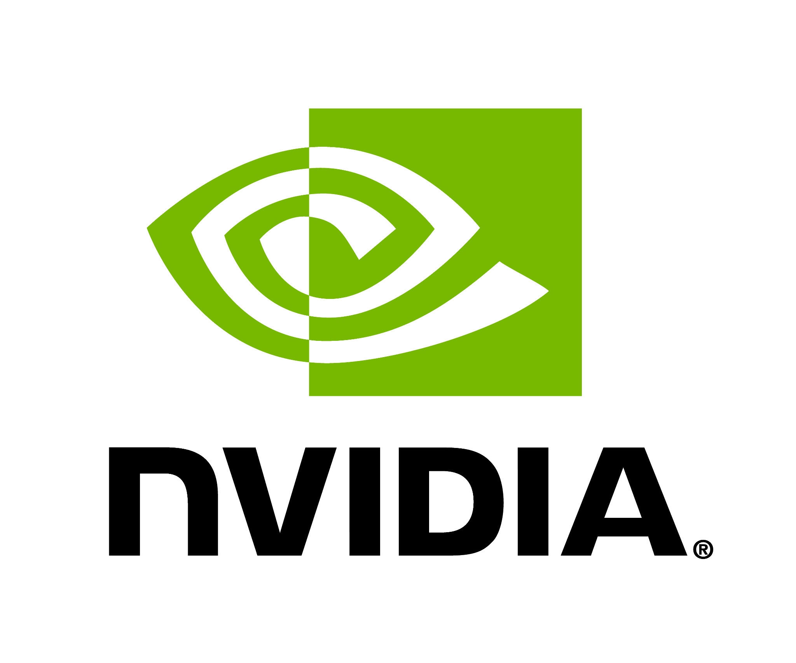

The fourth online KubeVirt Summit is coming on June 24-25!

## What is KubeVirt Summit?

KubeVirt Summit is our annual online conference, now in its fourth year, in which the entire broader community meets to showcase technical architecture, new features, proposed changes, and in-depth tutorials.
We have two tracks to cater for developer talks, and another for end users to share their deployment journey with KubeVirt and their use case(s) at scale. 

## When is it?

The event will take place online over two half-days:

- Dates: **June 24 and 25**, 2024
- Time: 12:00-17:00 UTC 

> note "Note"
> Previously Summit had been announced with dates of June 25-26

## How do I register?

**Register now at the [CNCF KubeVirt Summit event page](https://community.cncf.io/events/details/cncf-virtual-project-events-2024-hosted-by-cncf-presents-kubevirt-summit-2024/)**

## Schedule

All times are in UTC.

### Monday, June 24

**12:00-12:25 _Welcome, Opening Remarks, and Community Updates_**

**12:30-12:55 _Keep your VM dancing with volume migration_**  
Alice Frosi, Red Hat  
Description: Want a refresh of your storage? Is there a better performing class available in your cluster? Is an old one being deprecated? Don’t panic, you don’t need to turn off your VM.

The new option for [updateVolumeStrategy](https://github.com/KubeVirt/community/blob/main/design-proposals/volume-update-strategy.md) allows you to update and migrate storage while the VM is running. You just need to apply a new VM definition that replaces the existing volumes with new ones. This update will initiate the volume migration, and at the end of the process, the VM will have entirely copied the data from the old volumes to the new ones without any workload disruptions.

The talk will cover what you can do with this new feature and go over the technical decisions that lead to the final design.

**13:00-13:25 _Running Kubernetes clusters the Kubernetes-native way_**  
Andrei Kvapil, Ænix  
Description: Have you ever thought about building your own cloud? I bet you have. But is it possible to do this using only modern technologies and approaches, without leaving the cozy Kubernetes ecosystem?

- How KubeVirt helps create secure environments.
- Hard multi-tenancy with KubeVirt and Kamaji.
- Cluster autoscaler configuration for Cluster API.
- Operating KubeVirt with its CSI and CNI drivers.
- Securing API by removing controllers from the user clusters.

**13:30-13:55 _Using CPU & Memory hotplug for VM vertical scaling_**  
Igor Bezukh, Red Hat  
Description: I am going to present the CPU & Memory hotplug features towards the live update API, how it can be actually used for VM vertical scaling, and the future plans to use in-place pod update instead of live-migration. If time will allow, I will also try to discuss what needs to be accomplished to support auto-scaling.

**14:00-14:25 _Long-Lived User-Session VM: Enhancing Zero Downtime Rolling Deployments for Virtual Machines with Kubernetes Operators_**  
Sheng Lin, Nvidia  
Description: NVIDIA's cloud-gaming service, GeForce Now, leverages Kubernetes-managed data centers to render games and stream the output in real-time to a variety of client devices, including computers, smartphones, and tablets. Implementing rolling deployments for long-lived user-session virtual machines presents unique challenges. Each client’s traffic is tied to a specific virtual machine, so any disruption can result in immediate user impact. Depending on the service, a rolling deployment could take up to eight hours as it waits for in-progress sessions to conclude. 

In this presentation, we will delve into how NVIDIA GeForce Now enhances zero downtime rolling deployments by utilizing a Kubernetes operator. Attendees will gain insights into:

- The specific challenges of rolling deployments for long-lived VMs in a Kubernetes environment. 
- The architecture, development, and deployment of the Kubernetes operator that facilitates seamless VM rollovers. 
- Real-world case studies comparing service availability and maintenance overhead before and after implementing the Kubernetes operator. 
- Practical recommendations for adapting and generalizing this operator-based approach for other VM-based services. 

Join us to learn how to achieve efficient and reliable rolling deployments, ensuring uninterrupted user experience and streamlined maintenance processes. 

**14:30-14:55 _KubeVirt vDPA Workflow: From Host to Pod to Domain_**  
Taekyung Kim, SK Telecom  
Description: In this presentation, we will explore the KubeVirt vDPA workflow, tracing its path from the host system to Kubernetes pods and the libvirt domain. We will start with an overview of the switchdev model, highlighting its significance in network hardware offload and the implementation in the host kernel. Following this, we will examine the integration of VF representors into Kubernetes CNI, illustrating how the CNI recognizes and manages both VF network interface and VF representor. Finally, we will explore the KubeVirt network binding plugin, demonstrating the process of passing vhost_vdpa from a Kubernetes pod to a libvirt domain. This session will provide valuable insights into enhancing network performance with KubeVirt and vDPA, offering practical guidance for real-world applications.

**15:00-15:25 _Build a full measurement chain using the CC-FDE solution in KubeVirt._**  
Lei Zhou, Wenhui Zhang & Xiaocheng Dong, Intel  
Description: Confidential computing (CC) provides hardware-based protections for data-in-use beyond traditional data-in-transit(network) and data-at-rest(storage). Full Disk Encryption (FDE) adds an additional layer of preserving integrity and confidentiality of the initial state of the workload and also protection by encrypting data-at-rest. This multi-layered approach ensures that even if one layer is breached, sensitive data remains encrypted and inaccessible. 

With traditional FDE, use DM-verity to safeguard image integrity, and employ encryption techniques to ensure data confidentiality. In CC FDE design, the secret key can be better protected via a passwordless attestation process by binding to CC trust evidence. The process includes enrolling encryption keyid into OVMF, retrieving key via keyid through FDE agent via remote attestation, and decrypt automatically.

In the above process, the TCB measurement is the key consideration. Although the advantage of  KubeVirt flavor like confidential VM (by comparison with Confidential cluster/container) is smaller TCB, it still has the challenges like vTPM complexity, readiness and various vendor’s security harden Trust foundation. So, we created a vendor unlocked CC Trusted API.

With CC FDE design by using CC Trusted API, it guarantees the integrity and confidentiality of images from building to deploying. The audience can learn how confidential computing impacts the traditional FDE, how to adopt CC FDE in KubeVirt for minimal TCB deployment flavor, then they can easily scale this solution in production quickly.

**15:30-15:55 _Optimizing GPU Capacity across multiple Data Centers_**  
Vinay Hangud, Nvidia  
Description: The talk will cover details about use case, design and workflow on how the Nvidia GeForce Now platform leverage a GPU Capacity to orchestrate VM workloads across a fleet of Data Centers.

Use case: 
Nvidia GeForce Now platform intends to maximize GPU usage in a Data Center while catering to an on-demand continuous churning VM work load.

Specific constraint: 
VM should get to running state and not get stuck at “not scheduled” due to capacity unavailability.

Design details: 
- The system leverages a GPU Capacity API to get accurate capacity information in a DC. 
- Design details of the GPU Capacity API and Controller. 
- Events driven mechanism to keep track of accurate GPU Capacity information during workload churn.

Nvidia GeForce Now workflow: How Capacity API is leveraged to orchestrate workload across a fleet of Data Centers at full GPU capacity to achieve on-demand scheduling needs.

**16:00-16:25 _Isolating container workloads in Virtual Machines using KubeVirt_**  
Vladik Romanovsky, Red Hat  
Description: While Kubernetes provides container sandboxes that utilize Linux kernel features for isolation, vulnerabilities still exist, these may cause host kernel panics, exploits, memory access by other applications, and more. 

Join this session to learn more about how the MaroonedPods project offers to solve the workload isolation problem using KubeVirt and all native Kubernetes components without a need for a specialized environment or dedicated software.

**16:30-16:55 _DRA in KubeVirt: Overcoming Challenges and Implementing Changes_**  
Varun Ramachandra & Alay Patel, Nvidia  
Description: As the demand for GPU-accelerated workloads continues to surge across various industries, Kubernetes has emerged as a popular orchestration platform to manage these resources efficiently. However, the traditional GPU device plugin model in Kubernetes poses limitations in terms of flexibility, scalability, and resource optimization. 

This talk introduces the concept of Dynamic Resource Allocation (DRA) and demonstrates how transitioning GPU device plugins to DRA can address these challenges.  In this session, attendees will learn about how Nvidia plans to solve the specific challenges in KubeVirt to leverage the advantages of DRA.

### Tuesday, June 25

**12:00-12:25 _Optimizing live-migration for minimizing packet loss with KubeVirt and kube-ovn_**  
Zhuanlan & Zhangbingbing, China Mobile(SuZhou)Software Technology Co.,Ltd.  
Description: We expose more detailed steps for virtual machine live-migration in KubeVirt. Which enable kube-ovn use the multi_chassis_bindings feature as will as triggering ACL policy changes based on RARP. In this way, we significantly reduces packet loss during live migrations.

**12:30-12:55 _KubeVirt Observability with Prometheus and Grafana_**  
Ananda Dwi Rahmawati, Activate Interactive Pte Ltd  
Description: As KubeVirt adoption grows, so does the need for effective observability. This talk delves into the essential metrics and tools required to ensure the health and performance of your KubeVirt environments. 

We'll explore practical strategies for monitoring KubeVirt workloads, identifying potential issues, and gaining valuable insights into your virtualized environment.

**13:00-13:25 _Want a VM with local storage? Fine, just try it with Hwameistor!_**  
Pang Wei & Zhou MingMing, QiAnXin  
Description: There are many benefits to use VMs with local storage, like:

- Superior performance with local disk IOPS/latency/throughput.
- Less complexity compared to network-based storage system.
- Extremely low cost, VMs can be created easily even in an all-in-one k8s cluster.

I'm glad to introduce a good way to do this. With the help of [HwameiStor](https://github.com/hwameistor/hwameistor), VMs can be smoothly used with local storage(LVs or raw disk).

**13:30-13:55 _Real-Time Network Traffic Monitoring for KubeVirt VMs Using OVN and Switchdev SR-IOV VFIO Interfaces_**  
Girish Moodalbail & Vengupal Iyer, Nvidia  
Description: When the data plane is offloaded from the Linux kernel to Smart NICs that support the Linux SwitchDev driver model, the ability to perform real-time monitoring of network traffic for debugging or anomaly detection is lost. This issue is exacerbated when using legacy non-switchdev SR-IOV Virtual Functions (VFs), where packets sent through these VFs are only visible on the next hop switch. Consequently, any debugging efforts would require collaboration with network administrators managing the switches. Additionally, performing real-time monitoring of network traffic for anomaly detection on switches becomes significantly more challenging.

In this presentation, we will explore how to achieve real-time monitoring of KubeVirt VMs/VMIs that are multi-homed with Switchdev SR-IOV VFIO interfaces using the open-source Open Virtual Network (OVN) SDN based on Open vSwitch (OVS). The API is defined by OVN-Kubernetes CNI as a Kubernetes Custom Resource. We will introduce the OVN packet mirroring feature, which enables the capture of packets from these interfaces and their forwarding to Scalable Functions (SFs) on the host. This process can be performed at wire speed thanks to NIC accelerators, allowing for the execution of tools like tcpdump, sFlow, and deep learning inference on the captured packets.

**14:00-14:25 _Enhancing KubeVirt Management: A Comprehensive Update on KubeVirt-Manager_**  
Marcelo Feitoza Parisi, Google Cloud  
Description: KubeVirt-Manager continues to evolve as a pivotal tool for simplifying and streamlining the management of virtualized environments with KubeVirt. In this session, we'll present a comprehensive update highlighting the latest enhancements and features designed to further empower administrators and users, and help accelerate even more the adoption of KubeVirt. From improved visibility with unscheduled Virtual Machines grouped in the Virtual Machines page, to a revamped NoVNC implementation supporting complete console functionality, our latest release promises a more seamless experience. 

Additionally, we introduce a new detailed information page for Virtual Machines and Virtual Machine Pools, providing insights into crucial details such as operating system version, kernel version, networking configuration, and disk specifications. Not stopping there, we also present enhancements extend to the Virtual Machine creation process, now offering options to select cache mode and access mode for disks, as well as the ability to utilize multiple network interfaces. Virtual Machine Pools receive a significant upgrade with support for Liveness Probes and Readiness Probes, alongside the introduction of auto-scaling based on Kubernetes HPA. Moreover, our integration with Cluster API provides now a streamlined option for administrators and users to bring new Kubernetes clusters with just a few clicks. 

Join us as we delve into these exciting updates to facilitate the management of KubeVirt environments.

**14:30-14:55 _Hack your own network connectivity_**  
Edward Haas & Leonardo Milleri, Red Hat  
Description: KubeVirt provides common network connectivity options for Virtual Machines that satisfy most scenarios and users. As the project popularity grows, special scenarios and needs surface with requests to tweak and customize network details. The sig-network was faced with a double challenge, to satisfy the growing community needs and at the same time to keep the codebase in a maintainable state.

The [network binding plugin](https://github.com/kubevirt/kubevirt/blob/main/docs/network/network-binding-plugin.md) has been introduced to solve these challenges, giving the ability to extend the network connectivity in KubeVirt and at the same time assist in maintaining the core network functionality.

We will present the pluggable infrastructure and demonstrate a success story that used it to extend the supported interfaces (vDPA).

**15:00-15:25 _Introducing Application Aware Resource Quota_**  
Barak Mordehai, Red Hat  
Description: If you want to hear about how Application Aware Resource Quota solves KubeVirt's Quota related issues during migrations and obscures Virtual Machines overhead from Quota - this session is for you.

You will also hear how this project opens the door for plug-able policies to empower other operators to customize resource counting. 

**15:30-15:55 _KubeVirt enablement on IBM Z and LinuxONE_**  
Nourhane Bziouech, IBM  
Description: Kubevirt keeps evolving and growing in features and capabilities , and one of the growth aspects is the platforms where it runs.

 This session will cover the usage of Kubevirt for s390x architecture when running it on IBM Z and LinuxONE. Join me in this session and let me take you through the journey of adding Kubevirt to the IBM Z and LinuxONE platform.

**16:00-16:25 _Ensuring High Availability for KubeVirt Virtual Machines_**  
Javier Cano Cano, Red Hat  
Description: Maintaining high availability of Pod workloads within Kubernetes is a common objective, typically achieved using Kubernetes' built-in primitives. However, certain workloads, such as KubeVirt Virtual Machines (VMs), necessitate at-most-one semantics, which can only be achieved with the assistance of additional operators like Node Health Checks (NHC) and specific remediation operators.

This presentation will explore the methods for establishing a high-availability infrastructure specifically designed for KubeVirt virtual machines (VMs). The discussion will encompass the development of a testing methodology for KubeVirt in conjunction with the Node Health Check (NHC), including the assessment of VM recovery times in the event of node failure. The presentation will detail the challenges encountered, the debugging process, and the solutions implemented, with a focus on the current status of VM recovery times.

**16:30-17:00 _Coordinated Upgrade for GPU Workloads_**  
Natalie Bandel & Ryan Hallisey  
Description: In this talk, we will explore how the Nvidia GeForce Now platform manages maintenance and upgrade activities on Kubernetes clusters with KubeVirt workloads by leveraging native Kubernetes components.

Ongoing maintenance is essential for any Kubernetes cluster. The complexity of coordination and management of the maintenance activities only increases for Kubernetes clusters with KubeVirt and thousands of VMIs running simultaneously.  In this talk, we will explore how the Nvidia GeForce Now platform leverages native Kubernetes components to manage and coordinate maintenance activities on Kubernetes clusters with thousands of GPU workloads across multiple data centers. We will present the architecture and benefits of our approach, explaining how we maintain a single source of truth for real-time status updates from the Kubernetes cluster. We will discuss our efficient scheduling algorithm, which takes into consideration existing VMI workloads for prioritizing maintenance tasks. We will cover our validation and failure handling processes. And finally, we will highlight actual improvements of operational efficiency in maintenance times during GeForce Now upgrades.

## Have questions?

Reach out on our [virtualization](https://kubernetes.slack.com/messages/virtualization) Slack channel (in the Kubernetes workspace).

## Keep up to date

Connect with the KubeVirt Community through our [community page](/community).

### KubeVirt Summit is thankful for our sponsors

Our [patron sponsors](/sponsor/):  

